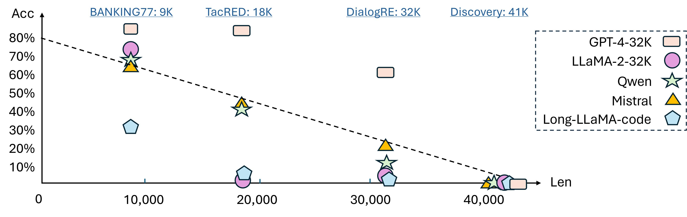

# 🐍 LongICLBench

[](http://arxiv.org/abs/2404.02060)

Long-context LLMs Struggle with Long In-context Learning

<div align="center">

</div>

Our principal discoveries reveal: 
* 1️⃣ A notable decline in the performance of even the most advanced models as the complexity of the tasks increases. 
* 2️⃣ In the most challenging scenarios, especially those with 174 classes, models find it difficult to discern subtle differences. 
* 3️⃣ The performance of certain models is sensitive to the position of the instances in the demonstrations.

## 🛠️ Set up
```
git clone https://github.com/TIGER-AI-Lab/LongICLBench.git
cd LongICLBench
pip install -r requirements.txt
```

## 🌈 Benchmarking
We collect six extreme-label classification datasets with details as below:

|             **Dataset**             |              Task Type               |              #Classes               |                #Tokens/Shot                | #Total Tokens |
|:-----------------------------------:|:------------------------------------:|:-----------------------------------:|:------------------------------------------:|:-------------:|
|            **GoEmotion**            |        Emotion Classification        |                 28                  |                     28                     |   [1K, 4K]    |
|            **BANKING77**            |        Intent Classification         |                 77                  |                     28                     |   [2K, 11K]   |
|             **TecRED**              |         Relation Extraction          |                 41                  |                     80                     |   [4K, 18K]   |
|            **Few-NERD**             |          Entity Recognition          |                 66                  |                     61                     |   [5K, 23K]   |
|            **DialogRE**             |         Relation Extraction          |                 36                  |                    226                     |   [8K, 32K]   |
|            **Discovery**            |   Discourse Marker Classification    |                 174                 |                     61                     |  [10K, 50K]   |

## 🎖️ Model Evaluation
We evaluate the performance of 13 long-context large language models. Their information are presented as follows:

|         Model         |  Size  |  Initialization  |           Strategy           |  Train  | Support |
|:---------------------:|:------:|:----------------:|:----------------------------:|:-------:|:-------:|
|     Gemma-7B-base     |   7B   |      Gemma       |          RoPE + LF           |   8K    |   8K    |
|    LLaMA-2-7B-32K     |   7B   |     LLaMA-2      |    Position Interpolation    |   32K   |   32K   |
|    ChatGLM3-6B-32K    |   6B   |     ChatGLM      |   Position Encoding Scheme   |   32K   |   32K   |
|   Qwen-1.5-7B-base    |   7B   |       Qwen       |   NTK-Aware Interpolation    |   32K   |   32K   |
| Mistral-7B-v0.2-base  |   7B   |     Mistral      |              LF              |   32K   |   32K   |
|  LLaMA-2-7B-LongLora  |   7B   |     LLaMA-2      |   Shifted Short Attention    |  100K   |  100K   |
|      Yi-6B-200K       |   6B   |        Yi        |  Position Interpolation +LF  |  200K   |  200K   |
|   InternLM2-7B-base   |   7B   |     InternLM     |         Dynamic NTK          |   32K   |  200K   |
|  Long-LLaMA-code-7B   |   7B   |     LLaMA-2      |     Focused Transformer      |   8K    |  256K   |
|     RWKV-5-World      |   3B   |       RWKV       |     Attention-free Model     |   4K    | &infin; |
|      Mamba-2.8B       |  2.8B  |      Mamba       |      State Space Model       |   2K    | &infin; |
|    Gemini-1.0-Pro     |   -    |      Gemini      |        Ring Attention        |   32K   |   32K   |
|      GPT4-turbo       |   -    |      GPT-4       |              -               |    -    |  128K   |

The evaluation results for some of the datasets is presented as follows: (Please check more details in our paper)

<div align="center">

</div>

🕹️	Run the script to re-obtain the demonstrated results:
```
sh script_goemotion.sh [model_short_name] [CUDA_DEVICES] [testing_examples_number]
sh script_bank77.sh [model_short_name] [CUDA_DEVICES] [testing_examples_number]
sh script_fewnerd.sh [model_short_name] [CUDA_DEVICES] [testing_examples_number]
sh script_tacred.sh [model_short_name] [CUDA_DEVICES] [testing_examples_number]
sh script_dialogue.sh [model_short_name] [CUDA_DEVICES] [testing_examples_number]
sh script_discovery.sh [model_short_name] [CUDA_DEVICES] [testing_examples_number]
```
