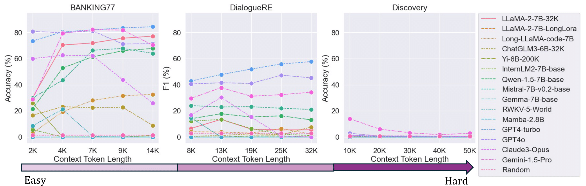

# 🐍 LongICLBench
This repo contains the official code and data for our paper [Long-context LLMs Struggle with Long In-context Learning](http://arxiv.org/abs/2404.02060)

[**🤗 HuggingFace Dataset**](https://huggingface.co/datasets/TIGER-Lab/LongICLBench)

[**🌟 Leaderboard**](https://huggingface.co/spaces/TIGER-Lab/LongICL-Leaderboard)

<div align="center">

</div>

We created LongICLBench to conduct comprehensive evaluations of Large Language Models (LLMs) on extreme-label classification challenges with in-context learning. We compiled six datasets that encompass a broad spectrum of labels, ranging from 28 to 174 categories, and varied the lengths of input (from few-shot demonstrations) between 2K and 50K tokens to ensure thorough testing
Our principal discoveries reveal: 
* 1️⃣ A notable decline in the performance of even the most advanced models as the complexity of the tasks increases. 
* 2️⃣ In the most challenging scenarios, especially those with 174 classes, models find it difficult to discern subtle differences. 
* 3️⃣ The performance of certain models is sensitive to the position of the instances in the demonstrations.

## 🛠️ Set up
```
git clone https://github.com/TIGER-AI-Lab/LongICLBench.git
cd LongICLBench
pip install -r requirements.txt
```

## 🌈 Benchmarking
We collect six extreme-label classification datasets with details as below:

|             **Dataset**             |              Task Type               |              #Classes               |                #Tokens/Shot                | #Total Tokens |
|:-----------------------------------:|:------------------------------------:|:-----------------------------------:|:------------------------------------------:|:-------------:|
|            **GoEmotion**            |        Emotion Classification        |                 28                  |                     28                     |   [1K, 4K]    |
|            **BANKING77**            |        Intent Classification         |                 77                  |                     28                     |   [2K, 11K]   |
|             **TecRED**              |         Relation Extraction          |                 41                  |                     80                     |   [4K, 18K]   |
|            **Few-NERD**             |          Entity Recognition          |                 66                  |                     61                     |   [5K, 23K]   |
|            **DialogRE**             |         Relation Extraction          |                 36                  |                    226                     |   [8K, 32K]   |
|            **Discovery**            |   Discourse Marker Classification    |                 174                 |                     61                     |  [10K, 50K]   |

## 🎖️ Model Evaluation
We evaluate the performance of 13 long-context large language models. Their information are presented as follows:

|        Model         |  Size  | Initialization |          Strategy          |  Train  | Support |
|:--------------------:|:------:|:--------------:|:--------------------------:|:-------:|:-------:|
|    Gemma-7B-base     |   7B   |     Gemma      |         RoPE + LF          |   8K    |   8K    |
|    LLaMA-2-7B-32K    |   7B   |    LLaMA-2     |   Position Interpolation   |   32K   |   32K   |
|   ChatGLM3-6B-32K    |   6B   |    ChatGLM     |  Position Encoding Scheme  |   32K   |   32K   |
|   Qwen-1.5-7B-base   |   7B   |      Qwen      |            RoPE            |   32K   |   32K   |
| Mistral-7B-v0.2-base |   7B   |    Mistral     |             LF             |   32K   |   32K   |
| LLaMA-2-7B-LongLora  |   7B   |    LLaMA-2     |  Shifted Short Attention   |  100K   |  100K   |
|      Yi-6B-200K      |   6B   |       Yi       | Position Interpolation +LF |  200K   |  200K   |
|  InternLM2-7B-base   |   7B   |    InternLM    |        Dynamic NTK         |   32K   |  200K   |
|  Long-LLaMA-code-7B  |   7B   |    LLaMA-2     |    Focused Transformer     |   8K    |  256K   |
|     RWKV-5-World     |   3B   |      RWKV      |    Attention-free Model    |   4K    | &infin; |
|      Mamba-2.8B      |  2.8B  |     Mamba      |     State Space Model      |   2K    | &infin; |
|      GPT4-turbo      |   -    |     GPT-4      |             -              |    -    |  128K   |
|        GPT4o         |   -    |     GPT-4      |             -              |    -    |  128K   |
|     Cluade3-Opus     |   -    |    Cluade3     |             -              |    -    |  200K   |
|    Gemini1.5-Pro     |   -    |     Gemini     |             -              |    -    |   10M   |

The evaluation results for some of the datasets is presented as follows: (Please check more details in our paper)

<div align="center">

</div>


🕹️	Run the script to re-obtain the demonstrated results: (You can just set [api_key] to '' for the locally deployed models)
```
sh script_goemotion.sh [model_short_name] [CUDA_DEVICES] 500 [api_key]
sh script_bank77.sh [model_short_name] [CUDA_DEVICES] 500 [api_key]
sh script_fewnerd.sh [model_short_name] [CUDA_DEVICES] 500 [api_key]
sh script_tacred.sh [model_short_name] [CUDA_DEVICES] 500 [api_key]
sh script_dialogue.sh [model_short_name] [CUDA_DEVICES] 500 [api_key]
sh script_discovery.sh [model_short_name] [CUDA_DEVICES] 500 [api_key]
```

To evaluate the results for Few-NERD and DialogRE with F1 score:
```
python fewnerd_evaluate.py --model [model_short_name] --round [number_of_rounds]
python dialogueRE_evaluate.py --model [model_short_name] --round [number_of_rounds]
```

## 🖊️ Citation

Please kindly cite our paper if you find our study useful:

```bibtex
@misc{li2024longcontext,
      title={Long-context LLMs Struggle with Long In-context Learning}, 
      author={Tianle Li and Ge Zhang and Quy Duc Do and Xiang Yue and Wenhu Chen},
      year={2024},
      eprint={2404.02060},
      archivePrefix={arXiv},
      primaryClass={cs.CL}
}
```
